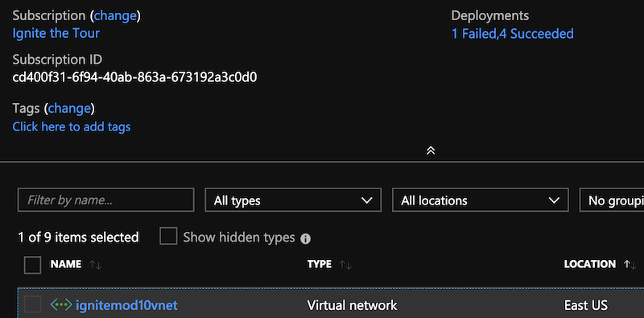

# MOD10 Demo instructions


** The creds below have been obscured.  You will need to ensure you have an MSSQL and Cosmos MongoDB API instance prior to start of demo **

# Abstract

_When Tailwind Traders acquired Northwind earlier this year, they decided to consolidate their on-premises applications with Tailwind Traders' current applications running on Azure. Their goal: vastly simplify the complexity that comes with an on-premises installation._

_In this session, you'll examine how a cloud architecture frees you up to focus on your applications, instead of your infrastructure. Then, you'll see the options to "lift and shift" a web application to Azure, including: how to deploy, manage, monitor, and backup both a Node.js and .NET Core API, using Virtual Machines and Azure App Service._


### The intro

**Welcome to the MOD track of Microsoft Ignite the tour**

Goals:

1. We'll spent time in each session learning about how to modernize our applications we may have already been running in a datacenter
2. As the day continues and you go further along the learning path you'll find new ways to simplify your hosting ops for your applications with Azure.

### Migrations are a big part of moving to the cloud:

Big time goals in your journey will be to:

- Assess (who's going to be involved, what will the costs be?)
- Migrate (move to a new hosting environment)
- Optimize (ensure we're doing the most for what we're spending)
- Secure (ensure that you're making the most out of the security options in Azure)


# Migrate and modernize

- Rehost – lift and shift (we'll focus on that today)
- Refactor – repackaging, but no major code changes
- Rearchitect – modernizing your code -breaking monoliths (implementing devops practices)

# Cloud Native

- Rebuild completely for cloud native – (logic apps, serverless, k8s)


# Move into tailwind traders talk:

**Big news**

Tailwind traders has decided it was time to break out of the datacenter and modernize by migrating their apps to Azure. By doing this, the team will be able to begin their path to becoming a completely cloud-first environment.  To get there we'll get started by "lifting and shifting" their application

# The App:

Right now it's a monolithic app

- Runs .Net core for API and React for front end
- Both run on a single server now
- Uses MongoDB and MSSQL for database (talks directly to it to store information about products, users and orders)

# What we'll do

1. We'll build a resource group to host
**A container that holds related resources for an Azure solution. The resource group includes those resources that you want to manage as a group. You decide how to allocate resources to resource groups based on what makes the most sense for your organization.**

2. **Why does a resource group need a location? And, if the resources can have different locations than the resource group, why does the resource group location matter at all?" The resource group stores metadata about the resources. Therefore, when you specify a location for the resource group, you're specifying where that metadata is stored. For compliance reasons, you may need to ensure that your data is stored in a particular region. **

3. We'll create a VNET
Virtual Network ( **VNet** ) is a representation of your own network in the cloud. It is a logical isolation of the  **Azure**  cloud dedicated to your subscription. Each  **VNet**  you create has its own CIDR block
   - can be linked to other VNets and on-premises networks as long as the CIDR blocks do not overlap.

4. Create a VM (linux)
  -  A full infrastructure as a service virtualized server
  -  Can be modified to grow or shrink as we move along on our modernization journey

Our old Server was a a 4 CPU server with 14GB ram, so we'll use a lift and shift comparable VM size, Standard\_DS3\_v2

  1. Git clone app
  2. Install dependencies
  3. Configure Env Variables
  4. Start app
  4. Browse to app
 

__(Explain to stick around for MOD20 to learn about the strategy for migrating our databases.)__


# What we'll use:

1. Cloud Shell
2. Azure Portal
3. VNET, VM
4. Git
5. Nodejs/dotnet core
6. MongoDB
7. MS SQL  

Demo:

1. Open portal
2. Open cloud shell
3. Create a resource group

**SPOKEN** "We're goung to create a resource group, in this command I'll name it ignitemod10, put it in my subscription specific to my app and then provide a location where our metadata for our resource group will be held"
 
```
az group create --subscription "Ignite The Tour" --name ignitemod10 --location eastus
```

4. VNET creation

**SPOKEN** "Now it's time to create our virtual network, this will replace all network gear you used to have to maintain.  Rather than configuring switchports and replacing failed line-cards, you can manage your network from the commandline or portal.

```
az network vnet create --name ignitemod10vnet --subscription  "Ignite The Tour" --resource-group ignitemod10    --subnet-name default
```

5. Show VNET in portal

**Navigate to Resource Group**



6.  VM Creation

**SPOKEN** "I've created a resource group, I have a network for our applications, now it's time we build a virtual machine for our application to be installed on."

```
az vm create --subscription "Ignite The Tour" --resource-group ignitemod10 --name twtweb --public-ip-address-dns-name twtweb --image UbuntuLTS --admin-username ubuntu --generate-ssh-keys --vnet-name ignitemod10vnet --size Standard\_DS3\_v2
```

8. Networking ports open:

**SPOKEN** Now that the server is built, it's time to permit network access to both the web app and SSH, we'll close up SSH when we finalize production.

```
az vm open-port --subscription "Ignite The Tour" --resource-group ignitemod10 --name twtweb --port 80 --priority "201"

az vm open-port --subscription "Ignite The Tour" --resource-group ignitemod10 --name twtweb --port 443 --priority "202"

az vm open-port --subscription "Ignite The Tour" --resource-group ignitemod10 --name twtweb --port 22  --priority "203"
```

# SSH in and begin installing our dependencies

```
ssh ubuntu@twtweb.eastus.cloudapp.azure.com
```

### Clone app, switch to branch 

```
sudo su 
git clone https://github.com/anthonychu/TailwindTraders-Website.git /tailwind
cd /tailwind 
git checkout monolith 
```

### Install dotnet 2.2

```
wget -q https://packages.microsoft.com/config/ubuntu/18.04/packages-microsoft-prod.deb -O packages-microsoft-prod.deb 
dpkg -i packages-microsoft-prod.deb 
add-apt-repository universe 
apt-get update 
apt-get install apt-transport-https 
apt-get install dotnet-sdk-2.2=2.2.102-1 -y 
```

### Install node / npm
```
apt install npm nodejs -y 
```

### Export ENV Vars

```
export apiUrl=/api/v1 
export ApiUrlShoppingCart=/api/v1 
```

### SQL Server

```
export SqlConnectionString="Server=tcp:twtsqlmod20.database.windows.net,1433;Initial Catalog=twtmod10;Persist Security Info=False;User ID=twtmod10;Password=;MultipleActiveResultSets=False;Encrypt=True;TrustServerCertificate=False;Connection Timeout=30;" 
```

### MongoDB Server

```
export MongoConnectionString="mongodb://:Hi5L2yajHopNUTDZRU8uDQf6hXYrK7WUPM4FVgk4P9h2VIRHircIkyKB7NFH0bTqC9WPBvHXc1YGGn2Y8XrHPw==@twtnosql.documents.azure.com:10255/?ssl=true&amp;replicaSet=globaldb" 
```

### Publish and start application 

```
screen
cd /tailwind/Source/Tailwind.Traders.Web 
dotnet publish -c Release 
dotnet bin/Release/netcoreapp2.1/publish/Tailwind.Traders.Web.dll 
CTRL A-D
```

### nginx

```
git clone https://github.com/neilpeterson/tailwind-reference-deployment.git
apt-get install nginx -y
service nginx start
rm /etc/nginx/sites-available/default
curl https://raw.githubusercontent.com/neilpeterson/tailwind-reference-deployment/master/deployment-artifacts-standalone-azure-linux-vm/default > /etc/nginx/sites-available/default
nginx -t
nginx -s reload
```

# Close

Ready to move forward on your next step to modernization?  Head over to Mod 20 where you'll learn to migrate your SQL and NoSQL data into managed services.

There's tons for you to learn here at MS Ignite the Tour, make sure you're up to date on all the sessions by going to
