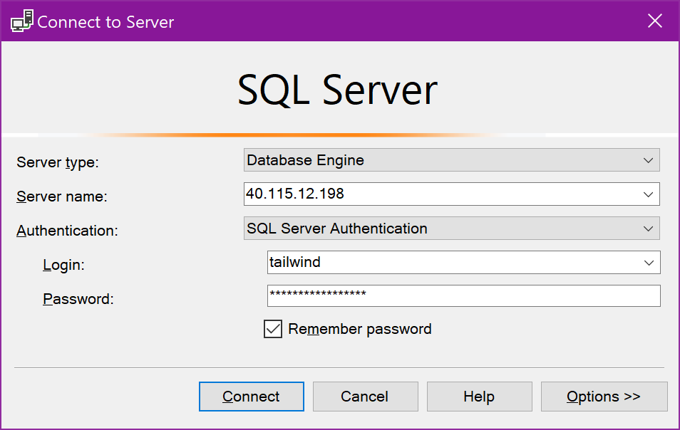
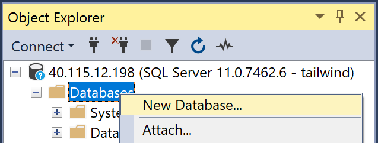
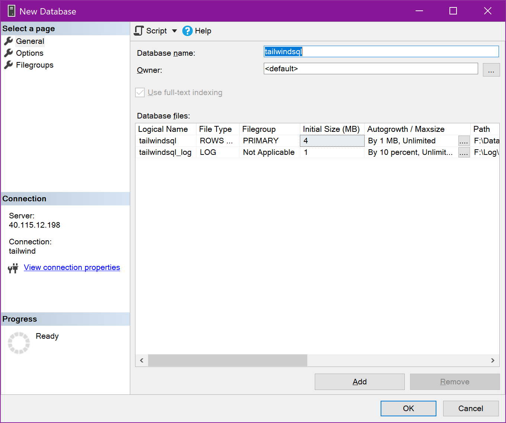

# Finishing the deployment

A few additional steps are needed to finish the deployment.

## I. Creating the SQL Database in the SQL Virtual Machine

> Note: This step is temporarily necessary while we look for a better way to do this in an automated manner.

1. In the Azure Portal, open the SQL VM named `mod20[prefix]sqlvm` where `[prefix]` is the unique prefix that you [prepared here](./01-preparation.md/#prefix).

2. In the Overview tab, copy the Public IP address.

3. Start [SQL Server Management Studio](https://docs.microsoft.com/en-us/sql/ssms/download-sql-server-management-studio-ssms?view=sql-server-2017).

4. In the `Connect to server` dialog, enter the IP address you just copied.

5. For the credentials, select `SQL Server Authentication` and enter the [credentials you created here](./01-preparation.md#credentials).

6. Right click on the Databases node and select `New Database...` from the context menu.

7. In `Database name` enter the name `tailwindsql` and click OK. You don't need to change any other settings.

## II. Running the website to populate the backup databases

The initial deployment is configured to connect the front-end website to the backup databases.

> There is a backup CosmosDB database for the shopping cart, and a backup Azure SQL Database for the products. These will be populated once and can be used during the session, in case the data migration fails for any reason.

To make sure that the backup databases are populated, follow the steps:

1. Open the App Service named `mod20[prefix]` where `[prefix]` is the unique prefix that you [prepared here](./01-preparation.md/#prefix).

2. In the Overview, click on the URL of the website to open it in another browser window.

3. Navigate to some of the products categories and make sure everything works fine, the images are displayed properly, etc.

4. Click on the `Login` link.

5. Enter an email in the login dialog. Make sure to remember which email you use and always use the same in the demos.

6. Enter any password. This field is dummy only.

7. Once you are logged in, add a few items to the shopping cart. Try to be consistent in which items you add to the cart, so that the demo doesn't look weird if you need to use these backup databases.

8. Go to the cart and modify the quantities of the items.

9. Log off the shopping cart.

## III. Preparing the Advanced Data Security for the Azure SQL Database

During the demo, we introduce some features of the Azure SQL Database, including the Advanced Data Security. This needs a little configuration first:

1. In the Azure Portal, open the resource named `mod20[prefix]sqldb` where `[prefix]` is the unique prefix that you [prepared here](./01-preparation.md/#prefix).

2. Open the tab `Advanced Data Security`.

3. Click on `Enable Advanced Data Security on the server`.

> Note that enabling Advanced Data Security costs a monthly fee, but there is a free trial period.

4. After the feature has been enabled, click on the Vulnerability Assessment area and click on the `Scan` button to Initiate a new scan.

> If you wait for a moment, the Vulnerability Assessment will start automatically.

5. Open the resource named `mod20[prefix]sqldb-bak` where `[prefix]` is the unique prefix that you [prepared here](./01-preparation.md/#prefix).

6. Open the Advanced Data Security tab.

7. Click on the Vulnerability Assessment area and click on the `Scan` button to initiate a new scan.

## IV. Preparing the "cheat sheet" commands.md

For your convenience during the demos, we prepared a "cheat sheet" named [commands.md](./commands-template.md) with all the connection strings, usernames, password, etc. 

> **IMPORTANT** Do not check the cheat sheet into a Github public repo, as this will be detected by Microsoft and you will have to remove the file and purge the history. You can check the document in a private repo if you want.

1. Navigate to the template "cheat sheet".

2. Save this file locally under another name, for example `commands.md`.

3. For every step in the template, follow the indications to replace the values with the correct values. Later during the demos you can use this cheat sheet to help you find the values easily and copy/paste them in the proper locations.

## V. Time to rehearse your demos!!

Every time before you start the demos, you will need to execute a few simple steps to make sure that the environment is ready. [These steps are described here in details](./05-prep-demos.md). Have fun!!