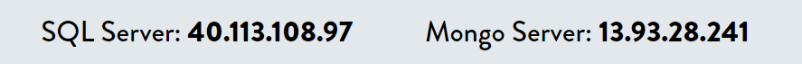
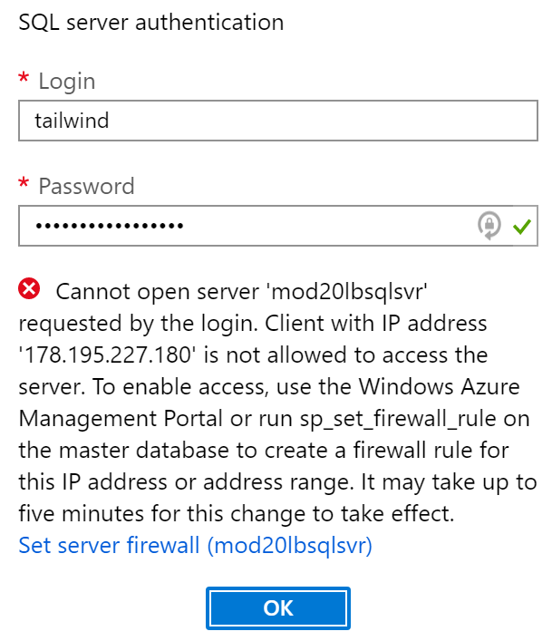
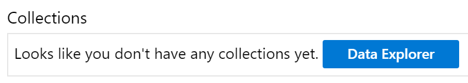

# Preparing for the demos

These steps must be executed everytime that you prepare to run the demos. The steps are fairly fast to execute but we recommend taking a little time to do these steps before your presentation. Typically we start preparing the demos about one hour before the presentation time.

> During this preparation step, you will have to copy some credentials and connection strings to the resources in the Azure Portal. To make things easier, you can use the "cheat sheet". We [provided a template](./commands-template.md) and some steps to [create this cheat sheet here](./04-prep-finish.md#cheatsheet).

## Configuring the connection strings

1. In the Azure Portal, open the App Service named `mod20[prefix]` where `[prefix]` is the unique prefix that you [prepared here](./01-preparation.md/#prefix).

2. Open the Configuration tab.

3. Under Application Settings, replace the variable named `MongoConnectionString` with the Mongo VM connection string.

4. Replace the variable named `SqlConnectionString` with the SQL Server 2012 connection string.

5. Press OK.

6. Press `Save`. The web application will take a few minutes to restart.

## Checking the VMs

1. Open [the Cloud Shell](https://shell.azure.com).

2. SSH into the Mongo VM to make sure it is working.

3. Exit and Clear.

4. Leave the browser window open.

5. Open a remote desktop connection to the SQL virtual machine.

6. Leave the RDP window open.

## Checking the website and making sure it works well

1. Open the App Service named `mod20[prefix]` where `[prefix]` is the unique prefix that you [prepared here](./01-preparation.md/#prefix).

2. In the Overview, click on the URL of the website to open it in another browser window.

3. Make sure that the debug header is showing IP addresses and not server names.



4. Navigate to some of the products categories and make sure everything works fine, the images are displayed properly, etc.

5. Click on the `Login` link.

6. Enter an email in the login dialog. Make sure to remember which email you use and always use the same in the demos.

7. Enter any password. This field is dummy only.

8. Once you are logged in, add a few items to the shopping cart.

9. Go to the cart and modify the quantities of the items.

10. Delete all the items by setting their quantity to 0.

11. Log off the shopping cart.

## Checking the Database Migration Service

1. Open the resource named `mod20[prefix]dms` where `[prefix]` is the unique prefix that you [prepared here](./01-preparation.md/#prefix).

2. Make sure that the DMS is running.

> **IMPORTANT** We noticed that sometimes the DMS stops working. In which case we recommend deleting it and creating a new one using the `Create a resource` button in the Azure Portal. Note that the DMS needs about 15 minutes to be deployed.

3. Make sure that all the migration projects are deleted.

## Checking the Azure SQL Database

1. Open the resource named `mod20[prefix]sqldb` where `[prefix]` is the unique prefix that you [prepared here](./01-preparation.md/#prefix).

2. Open the `Query Editor` tab.

3. Use the SQL server authentication to log into the database.

<a id="config-firewall"></a>
> On the first login from a new IP address, you will need to configure the firewall. Simply follow the instructions to add your client IP address to the firewall list.



4. In the Query editor, expand the Tables node.

5. If any tables are found, you need to delete them. In the Query field, enter the following SQL code where [tablename] is the name of the SQL table:

```
DROP TABLE [tablename]
```

6. Click the `Run` button.

7. After the query ran successfully, repeat the process for each SQL table.

8. Click on the Advanced Data Security tab and make sure that the Vulnerability Assessment area has some data.

9. Go back to the Overview. Leave the browser window open.

## Checking the Cosmos DB

1. Open the resource named `mod20[prefix]mongo` where `[prefix]` is the unique prefix that you [prepared here](./01-preparation.md/#prefix).

2. Make sure that all the Collections are deleted. You can see the collections in the Overview tab.



3. If the collections are not deleted, open the Data Explorer.

4. Delete the collections.

> **TODO** Add a screenshot.

5. Go back to Overview and leave the browser window open.

## Slides

1. Start the presentation :)

[The demos are described in details here](./06-demos.md). Have fun!