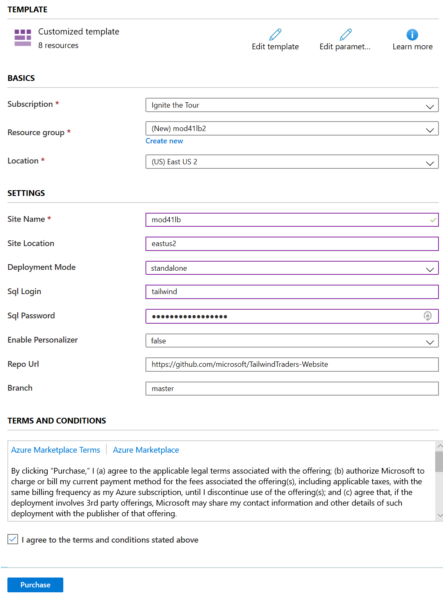

# MOD41 Demo deployment and preparation

The deployment of the demo is mostly automated. You can run this deployment for training purpose and then delete the resource group that you created, and deploy again. The deployment can also be run in parallel multiple times with a unique name. This is needed sometimes when multiple speakers are presenting the session in different locations at the same time.

In order to run the deployment, you will need the following decisions:

- A **location** where your services should be deployed. Note that not all the services used here are available at all Azure locations. We recommend choosing a location that allows running all services, for instance `East US 2` or `West Europe`.

- A **name for the application**. This name must be unique. We recommend using something like `mod41[prefix]` where the prefix can be, for example, your initials, etc.

> IMPORTANT: Because of some limitations in some services' names, the prefix should be **4 characters long maximum**. You should only use **the letters a-z or the digits 0-9** for the prefix.

## Initial deployment

The deployment for this session can be started by clicking on the `Deploy to Azure` button [at this location](https://github.com/microsoft/TailwindTraders-Website/tree/master/Source/Tailwind.Traders.Web/Standalone#deploy-to-azure-app-service-automatic-deployment).

This deployment installs a complete web application, including two databases (Azure SQL Database, CosmosDB) for the products and the shopping cart. It also installs all other resources needed to run this app.

In the browser window that opens, fill the data:

- Subscription: Select the subscription in which the resources should be deployed.

- Resource group: Create a new resource group. Try to name it consistently, for example we recommend `mod41[prefix]` where the prefix can be, for example, your initials, etc.

- Location: Enter the location that you selected for this session's demos, for example `East US 2` or `West Europe`.

- Site name: We recommend entering the same name as above for the resource group.

- Site location: Unfortunately at the moment you need to enter the location again as text (for example `eastus2` or `westeurope`).

- Deployment mode: Select `standalone`.

- SQL Login: Enter `tailwind`.

- SQL password: Enter `traderstraders42.`

- Enable personalizer: Set to `false`.

- Repo URL leave the default value, which should be `https://github.com/microsoft/TailwindTraders-Website`

- Branch: Leave the default value which shuld be `master`.

Then check the terms and conditions checkbox and click on `Purchase`.

After the deployment is complete, some additional steps will be needed to [complete the deployment](./02-prep-finish.md). Then you will be able to [prepare for the demo](./03-prep-demo.md), and then [run the demo](./04-demo.md).

The advantage of the automated deployment is that you can deploy and delete the resources as often as you need. To delete, simply [follow the steps described here](./05-cleaning-up.md).