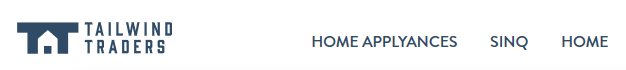
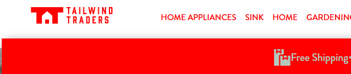

# Finishing the deployment

A few additional steps are needed to finish the deployment.

## I. Creating and configuring the Staging deployment slots

1. In the Azure Portal, open the App service you just deployed.

2. Open the Deployment slots drawer

3. Click on `Add Slot`

4. Enter the name `Staging` and select to clone the settings from the production slot.

5. Click on `Add`.

6. Click on the newly created Staging slot. Then, in the Staging slot, click on Deployment Center.

7. Select `External` as the source for continuous deployment. Then click on `Continue`.

8. Select `App Service build service` and click on `Continue`.

9. Under Repository, enter `https://github.com/lbugnion/TailwindTraders-Website`.

10. Under Branch, enter `Typos`.

11. Select `Git` Repository type.

12. Select `No` for Private repository.

13. Click on `Continue`.

14. Click on `Finish`.

15. Wait until the build is finished.

16. Click on Overview in the App Service.

17. Click on the URL to open the website in a new window.

You should now see the Tailwind Traders website, but there are some typos in the navigation menu, for example `Applyances` and `Sinq`.

> If you don't see the navigation menu, zoom the web brower window out a little to see more elements in the width.

## II. Creating and configuring the AbTest deployment slots

1. In the Azure Portal, open the App service you just deployed.

2. Open the Deployment slots drawer

3. Click on `Add Slot`

4. Enter the name `AbTest` and select to clone the settings from the production slot.

5. Click on `Add`.

6. Click on the newly created AbTest slot. Then, in the AbTest slot, click on Deployment Center.

7. Select `External` as the source for continuous deployment. Then click on `Continue`.

8. Select `App Service build service` and click on `Continue`.

9. Under Repository, enter `https://github.com/lbugnion/TailwindTraders-Website`.

10. Under Branch, enter `AbColor`.

11. Select `Git` Repository type.

12. Select `No` for Private repository.

13. Click on `Continue`.

14. Click on `Finish`.

15. Wait until the build is finished.

16. Click on Overview in the App Service.

17. Click on the URL to open the website in a new window.

You should now see the Tailwind Traders website, but the main color has been changed to red for the demo.

## V. Create a short link pointing to the website

Use your favorite link shortener to create a short link pointing to the Tailwind Traders website (Production slot). Later, we can use this to ask the audience to navigate to the site, and test the A/B testing slot.

## VI. Install different web browsers

To illustrate the A/B testing functionality, we'll need to open the same website in various web browsers, and we should get the new feature shown randomly. To do that, you'll need to have multiple web browsers. For more security and making sure that the new feature is shown, you should install 3 or 4 different browsers. For example, you can install [Edge Dev, Edge Canary, Edge Beta](https://www.microsoftedgeinsider.com/en-us/download).

## VII. Time to rehearse your demos!!

Every time before you start the demos, you will need to execute a few simple steps to make sure that the environment is ready. [These steps are described here in details](./03-prep-demo.md). Have fun!!
