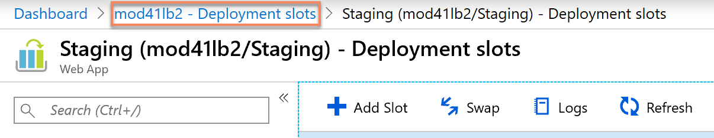

# Demo description

This page describes the demo. You can find the [recordings of the demo on the following page](./00A-videos.md). It can be useful to download the demo video and save it locally in case the internet doesn't allow you to connect to Azure reliably, etc.

> **Important**: Make sure to run the [preparation steps](./01-preparation.md) first.

## Demo: Showing the deployment slots

In this demo we will show two functionalities of the deployment slots:

- Publishing a new version of a web application without risks and without downtime
- Trying new features with A/B testing

### Fixing isues without risks

1. Show the App service in the Azure portal.

2. In the `Overview` tab, click on the website's URL.

3. Show a bit of the website's functionality

    - Navigate to a category.
    - Click on an item's details.
    - (If needed) log into the Shopping cart.
    - Click on Add to Cart.
    - Navigate to the Shopping cart.

4. Go back to the Azure portal.

5. Click on `Deployment slots`.

6. Explain what slots are, underline that 100% of the traffic goes to Production at the moment.

7. Go back to the website and show that there are some typos in the navigation menu.

8. Go back to the Deployment slots and explain that the typos have been fixed and deployed to the `Staging` slot. We will see later how the deployment is setup.

9. Click on Swap and make sure to swap the `Production` slot and the `Staging` slot.

> Swapping the slots takes a couple of minutes, which we will use to show a few details about how to create slots and deploy code to them.

10. Switch to another instance of the Azure Portal, to avoid interfering with the swap that is currently taking place.

11. Open the App Service again in the portal.

12. Click on `Deployment slots`.

13. Click on `Add Slot` and explain the process to create a new slot.

    - Explain that slots run in the same process, which minimizes the differences between them, and makes sure that we have very similar environments to test into.
    - Explain that the settings can be different between slots and show how to clone them.
    - Close the drawer without saving.

14. Click on the `Staging` deployment slot.

15. Show the `Configuration`, illustrating that every slot can have different settings.

16. Click on `Deployment Center`.

17. Show that this deployment comes from a branch named `Typos`, and explain that there are different ways to deploy to a slot, either with CI/CD or directly from Visual Studio, etc.

18. Go back to the previous window where the swap was taking place. Show that it is completed now.

19.  Go back to the website, and refresh the page. Show that the typos are fixed now.

20. Log into the shopping cart and then navigate to it. This should start throwing a lot of errors, because this slot's connection string to the CosmosDB database has been mangled during the preparation.

21. Click on the Back button to stop the errors and wait for them to disappear. Then log off the shopping cart.

22. Go back to the `Deployment slots`, and click on the `Swap` button again. Explain that getting back to the version with the typos but where the shopping cart was working is as simple as a click on the `Swap` button, and the previous version can be set again in just a couple of minutes. This is a peace of mind when deploying a new version.

> Show that the error could have been caught, because it is visible that the settings changed between the `Production` and the `Staging` versions.

### A/B testing

1. In the `Deployment slots` menu, click on the `AbTest` slot.

> If you cannot click on the deployment slot name as a link, it's probably because you are within a slot in the portal. To go back to the production slot's portal, you can use the navigation crumbs on top of the page.

2. In the `AbTest` slot, click on `Deployment Center`.

3. Show that the branch used here is called `AbColor`.

Explain that this is a branch where we are developing a new feature. In this case we modified the main color to be red. We now want to randomly test this new feature to gather feedback from our users.

4. Go back to the *Production slot* and in the `Deployment slots` page, show the Traffic again. At the moment 100% of the traffic goes to the `Production` slot.

5. Change the Traffic so that 50% of it goes to the `AbTest` slot. then click on `Save`.

6. Go back to the website and refresh the page. Normally it should be still the old blue version becauase we're still running in the same session.

7. Open another web browser. Make sure that it is a different browser, for example Edge Dev, Edge Beta or Chrome.

8. Navigate to the same URL. If we're lucky, it should be red. If it doesn't, try with yet another browser.

> Alternatively, you can also use the [short link you created earlier](./02-prep-finish.md#short-link), targeting the Tailwind Traders website. Then, ask your audience to load this short link on their smartphone. If they see the red color, they should raise their hand. Approximately 50% of the audience should have their hand raised.

## Cleaning up

Once you are done with the demos, you can [clean up the resources](./05-cleaning-up.md) to save money on resources.